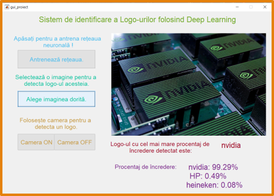
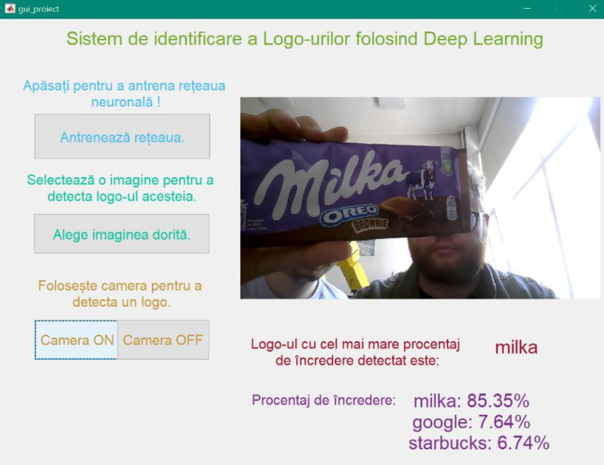

# Logo Identification System - Public Overview

Public technical overview of a MATLAB-based logo identification system that uses deep learning to recognize logos from uploaded images or a live webcam feed.

> The full source code is private due to intellectual property considerations. This repository documents the project functionality, technologies, screenshots, and implementation approach without exposing private source code or internal project history.

---

## Demo Screenshots

<p align="center">
  
</p>

<p align="center">
  
</p>

<p align="center">
  
</p>

---

## Project Summary

Logo Identification System is a MATLAB deep learning project for recognizing logos in images.

The application provides a graphical user interface where a user can load an image or use a webcam feed, process the input, and identify the most likely logo using a trained neural network model.

The project demonstrates a complete image-classification workflow, from dataset preparation and model training to GUI-based prediction and result visualization.

---

## Main Features

- Logo recognition from uploaded images.
- Logo recognition from webcam input.
- MATLAB graphical user interface.
- Deep learning model training and validation.
- Transfer learning using a pretrained CNN architecture.
- Image resizing and preprocessing.
- Prediction label display.
- Classification score visualization.

---

## How It Works

The system follows a simple image-classification pipeline:

```text
Input image or webcam frame
        ↓
Image preprocessing
        ↓
Resize to neural network input format
        ↓
Deep learning model inference
        ↓
Logo prediction
        ↓
Display predicted label and scores in the GUI
```

The model expects images to be resized to `227x227x3`, matching the input size required by the selected neural network architecture.

---

## Technologies Used

- MATLAB
- Deep Learning Toolbox
- AlexNet transfer learning
- Image Datastore
- Image preprocessing
- Image augmentation
- MATLAB GUI
- Webcam image capture

---


## Learning Outcomes

This project demonstrates practical experience with:

- deep learning for image classification;
- transfer learning;
- computer vision workflows;
- MATLAB-based model development;
- GUI-based machine learning applications;
- image preprocessing and resizing;
- prediction confidence interpretation;
- connecting a trained model to an interactive user interface.

---

## Source Code Availability

The full source code is private due to intellectual property considerations.

A technical walkthrough, selected implementation details, or a sanitized explanation of the architecture can be provided upon request.


